# User guide v.1.1 by Ivanov N.A.

## Welcome to Topino!

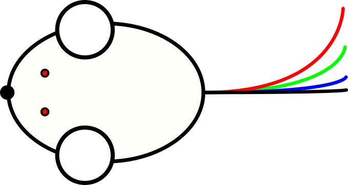{width=100px}

Whether it’s your first time analyzing Molecular Stream Separations (MMS) or something that you do regularly, please take time to read this small user guide to familiarise yourself with _Topino_, a handy software specifically designed for MSS. Topino is a simple and intuitive software that will help you to analyze MSS pictures, extract raw data, and generate manuscript-grade figures.

## Table of contents

1. [Image importing and preprocessing](#image-importing-and-preprocessing)
    1. [Image file import](#image-file-import)
    2. [Inlet tool](#inlet-tool)
    3. [Object properties bar](#object-properties-bar)
    4. [Image Preprocessing](#image-preprocessing)

2. [Analyzing the angulagram](#analyzing-the-angulagram)
    1. [Understanding your preprocessed data](#understanding-your-preprocessed-data)
    2. [Analyzing the angulagram by fitting peaks](#analyzing-the-angulagram-by-fitting-peaks)
    3. [Angulagram properties](#angulagram-properties)

3. [Additional and experimental features](#additional-and-experimental-features) (Topino V1.0)

## Image importing and preprocessing

### Image file import

In order to begin your journey with _Topino_, click on _File_ in the the top left corner of the menu bar and select the _Import image..._ option from the drop-down menu.

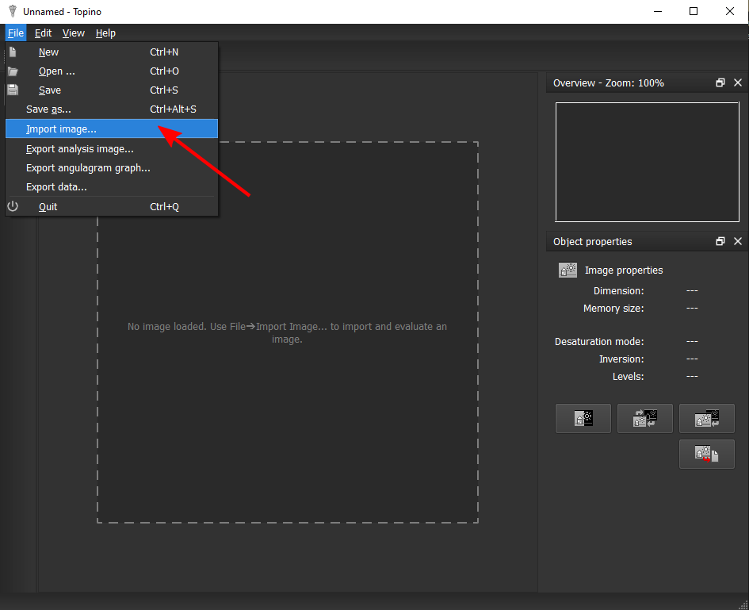

_Topino_ accepts most popular image files formats such as PNG (default) and JPEG. You can attempt to import a non-supported format by selecting the _All Files_ option from the drop-down menu in the _Open_-dialog.

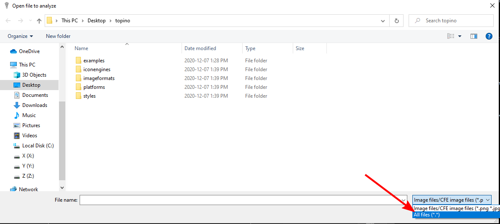

It is not guaranteed that the import will be successful. In principle, _Topino_ supports all formats that are supported by the Qt framework. However, the import might produce artifacts or the like, _e.g._ with RAW files. Future version of _Topino_ might support more image formats.

### Inlet tool

On the left side of the _Topino_ interface you can find the toolbar. It contains the _Inlet tool_ required to specify the position of your inlet as well as the _Ruler tool_. The latter is not required for the basic operation of _Topino_ and, therefore, discussed in [Additional features](#ruler-tool).

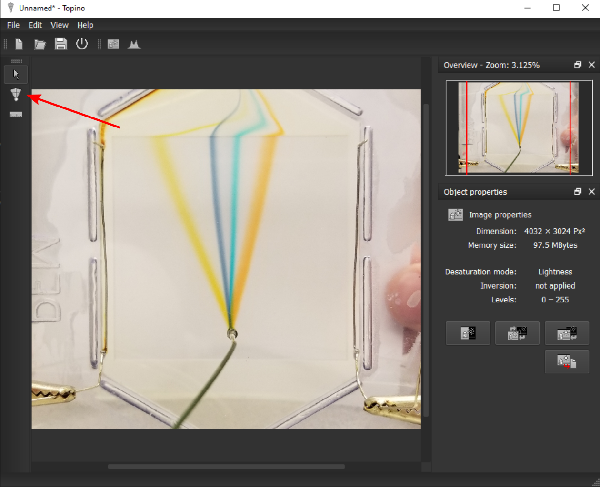

The first step of preprocessing your image is to tell _Topino_ where your inlet is located. The _Inlet tool_ generates an adjustable annular grid with a small red circle of variable size at the center. Your objective is to cover the inlet area with the small red circle and rotate the grid in the direction of the flow. By default, the range is set from -30° to +30° and can be adjusted either by dragging on the boundaries of the grid with the mouse cursor or by changing values in the _Object Properties_ discussed in the [next section](#object-properties-bar). Only the area covered by the grid is used for further processing. The small red circle is used to exclude the inlet area as it often contains non-useful information.

Select the _Inlet Tool_ and position your mouse cursor at the center of your inlet. Click and hold the left mouse button (LMB) dragging it towards the edges of your inlet. When the entire inlet zone is covered by the small red circle, release LMB. This action should generate a visible annular grid similar to the one in the following picture that you can rotate, expand, and move around.

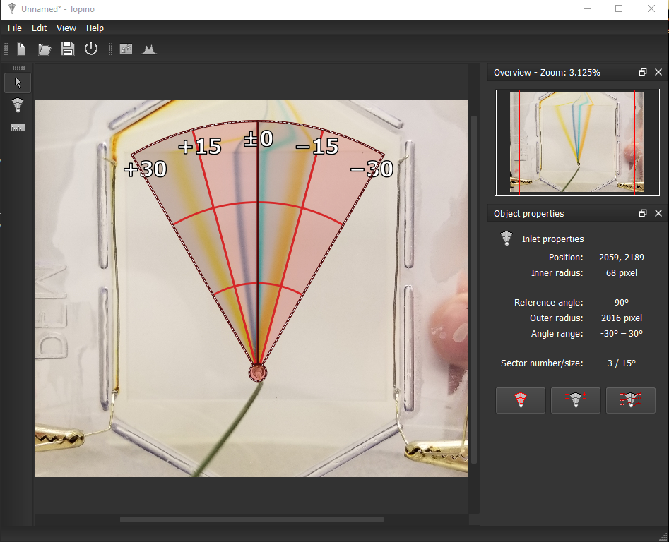

### Object properties bar

On the right side of the _Topino_ interface, you can find the _Object Properties_. It can display either object properties of the imported image (if nothing is selected) or properties of objects (e.g. inlet positioning grid) depending on what is currently selected. 

Let us explore _Inlet properties_ first. For this, make sure that the inlet you created in the previous step is selected:

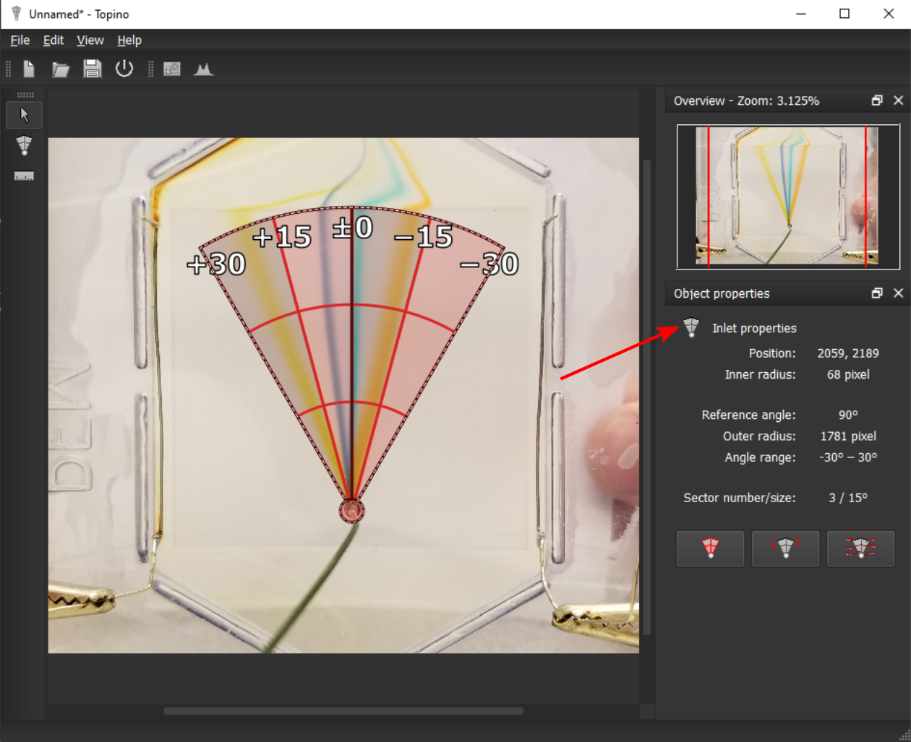

| Button   | Function  |
|----------|-----------------------------------------------------------------------------------------|
| | Sets your currently selected inlet as the _Main Inlet_ if multiple sample inlets are specified. Only one _Main inlet_ can be designated at a time because the polar coordinate system can have only one origin.    |
| 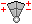    | Reverses positive and negative annular values on the displayed grid.   |
| 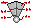    | Shows a dialog that allows modification of the parameters of the annular grid. This dialog has the advantages of holding additional parameters, as well as their exact numerical values, not accessible through direct cursor interaction with the grid. One can use it to fine-tune a quickly placed annular grid.  |

The _Image properties_ can be viewed when nothing is selected (just click on any empty space, the image, or press _Esc_). It contains several important functions and useful image information such as resolution, selected desaturation mode, and adjusted histogram levels. There are 4 buttons visible:

Let us explore _Image properties_. For this, make sure that nothing is selected by simply pressing _Esc_:

| Button   | Function  |
|----------|-----------------------------------------------------------------------------------------|
| 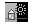    | Shows the _Image preprocessing_ dialog. Proper image preprocessing is crucial for angulagram analysis. Select a desaturation mode and carefully tweak the histogram. The objective is to maximize the contrast between image background and molecular streams of interest. The selection of the right desaturation mode will depend on the colours of the background, streams, and image noise and is left at your discretion. A preview on the left of the dialog is included for your convenience. For images with a bright background and dark streams it is recommended to invert the preprocessed image to generate positive peaks in the angulagram. When preprocessing is complete you should see a high-contrast image with the previously placed and adjusted overlay grid.   |
| 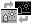    | Swaps between preprocessed and the original imported image   |
| 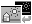    | Resets the image to its original state.  |
|     | Exports the preprocessed image as PNG file. |

### Image preprocessing

Once an image is imported and the inlet tool has been properly positioned we can begin preprocessing our image. 

Topino works by integrating the intesity signal over radius of the previously positioned inlet tool in 0.1 degree increments. Therefore, it is important to convolute the imported RGB intensities into a single intesity value during the preprocessing step. To begin click on your imported image and then on the _Preprocess image_ button. This menu will allow you to select from a multitude of Desaturation\Convolution modes. Assuming that the contrast of an imported image is good, the default _Lightness_ desaturation mode will do the job. We recommend to use _Lightness_ desaturation mode without any modifications to the histogram setting (_Adjust levels_) whenever possible to minimise user-to-user analysis variability. However, certain cases of poor image contrast would require the user to modify the histogram setting to achieve the best results.

Topino is designed to work with both Fluorescence and Light Absorbance based molecular stream imaging techniques.  Absorbance based images need to be color inverted during the preprocessing step to avoid generating negative peaks. This option is available when selecting a desaturation mode in the _Preprocess image_ menu.   

## Analyzing the angulagram

### Understanding your preprocessed data

This chapter begins with the preprocessed image overlayed with the annular grid. By clicking on _Show and edit the angulagram_ the second part of the analysis is initiated. 

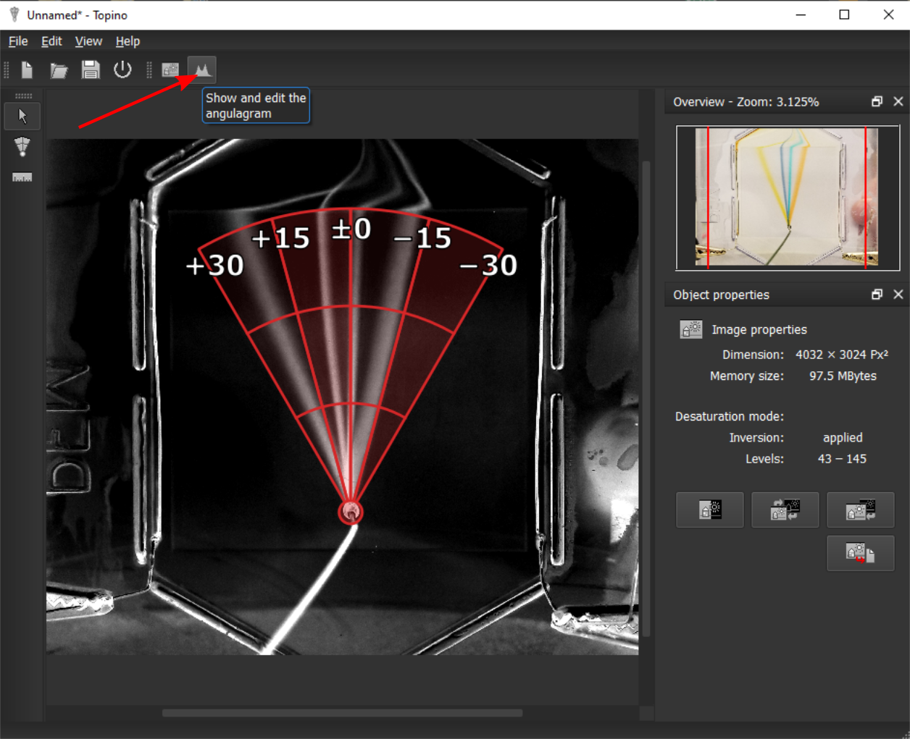

_Topino_ will convert the imported image from Cartesian to Polar coordinate system with the previously specified main inlet at the origin. The resulting _Polar image_ serves as the template for the angulagram generation. To view the converted _Polar image_, press the respective button on the [object properties bar](#angulagram-properties). 

The polar image is then integrated over the radius for each angle and the preliminary angulagram is presented in the main window. If good contrast was achieved during the preprocessing step all streams should appear as well-spaced distinct peaks.

### Analyzing the angulagram by fitting peaks 

Click on the _Evaluate angulagram_ button on the right side of _Topino_ to start the fitting process. Fitting is done mostly automatically in three steps: First, data is smoothed by a [Gaussian kernel](https://en.wikipedia.org/wiki/Kernel_smoother#Gaussian_kernel_smoother). Second, _Topino_ detects maxmima (peaks) and minima (valleys between peaks) to split the angulagram into sections (ideally: one peak per section). Third, each section is fitted to a Lorentzian function by the [Levenberg-Marquardt algorithm](https://en.wikipedia.org/wiki/Levenberg%E2%80%93Marquardt_algorithm).

In the preview dialog, you can adjust some of the fitting parameters such as the Gaussian noise and threshold. For instance, adjusting the threshold will allow to remove the noise on the left and right side of the angulagram, which is often incorrectly identified as peaks. Adjusting the smoothing parameters will remove false-positive peaks (small minima/maxima). If you are happy with the fit preview, simply press _Ok_ to accept these parameters and fitting.

After fitting your peaks, _Topino_ will automatically calculate all stream parameters (deflection, width, linearity, resolution) and display it in the table on the right side of the main window.

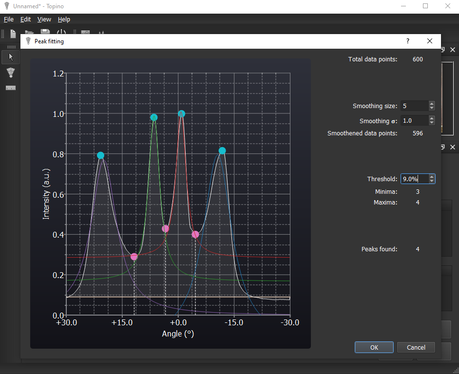

__Note__: If small manual modifications to the fitting parameters cannot give you a good fit, please return to the preprocessing step and modifiy its histogram values and/or the desaturation method (or capture a better image).

### Angulagram properties

Let us explore _Angulagram properties_:

| Button   | Function  |
|----------|-----------------------------------------------------------------------------------------|
|     | Evaluates the angulagram by fitting peaks.   |
|     | Exports the angulagram as raster image (PNG) or vector image (SVG). |
| 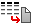    | Exports the raw data as text file suitable for import into any spreadsheet application (Excel, Origin, etc.).  |
|     | Show the polar image generated. It can be used to verify the fidelity of the previously placed inlet and its size. Ideally, all streams in the polar image should look like cones that get progressively thinner as they approach the right boundary. You can also export the polar image as PNG here. |
|     | Generate and show the radialgram. This is an experimental feature not required for standard processing. |

## Additional and experimental features

_Topino_ has two advanced and experimental features, _i.e._ the _ruler tool_ and the _radialgram_. All these advanced functions are not needed for every day assessment of MSS but are meant as power features for advanced users that need an extra bit more control and precision for difficult-to-assess border cases.

The _ruler tool_ can be used to quickly align and expand the annular grid to any image feature (such as corners and the like) used as reference. This tool can be employed to offset rotated images and fine adjust angles, etc.

The _radialgram_ integrates the polar image over the angle instead of the radius, which can be used to follow the progression and dispersion of streams through the separation zone. A typical radialgram is shaped as a half-peak that follows progressive loss of signal intensity due to molecular diffusion of streams. Any deviations from this expected shape can point to debris found on the MSS device (sudden narrow drops), non-uniformity in lightning or exposure (overall curve shape change), or errors in pre-processing of the image (random peaks or drops). 

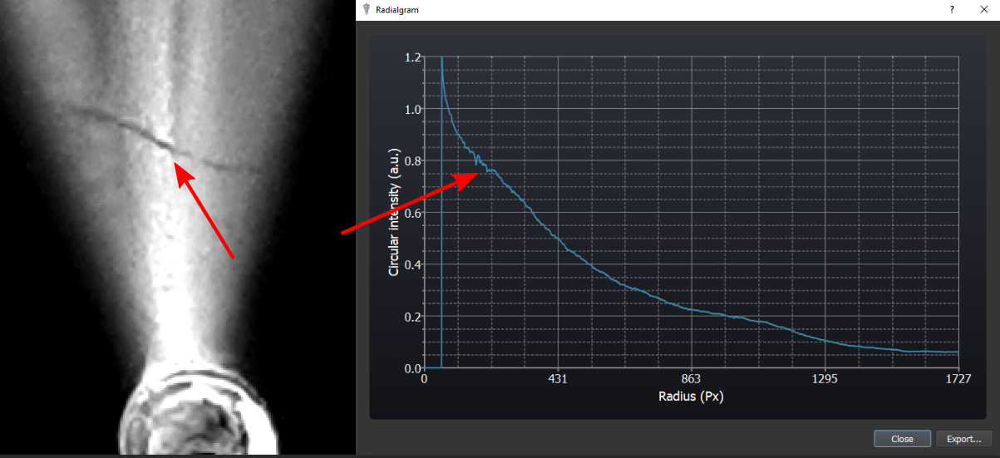

